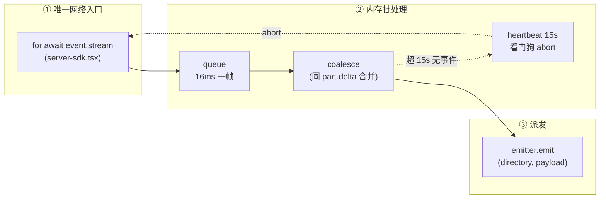
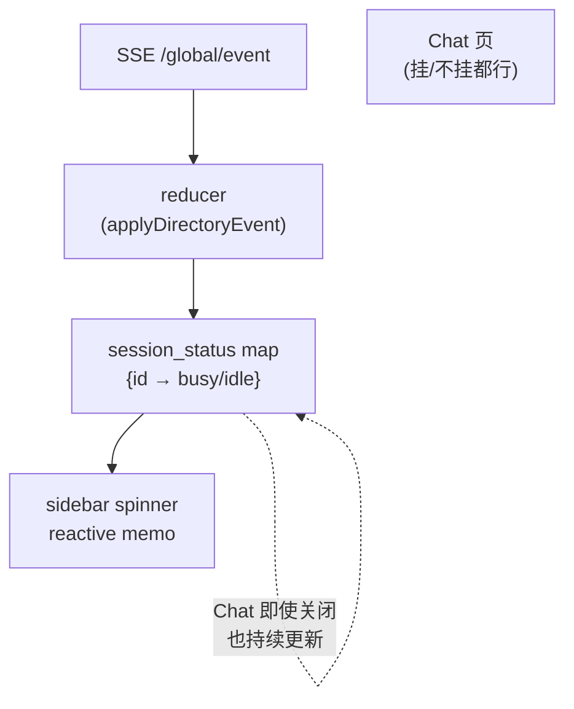
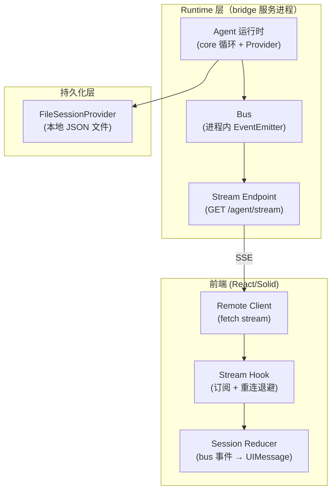
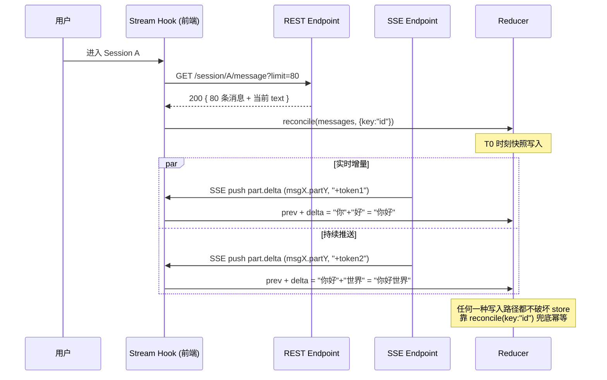
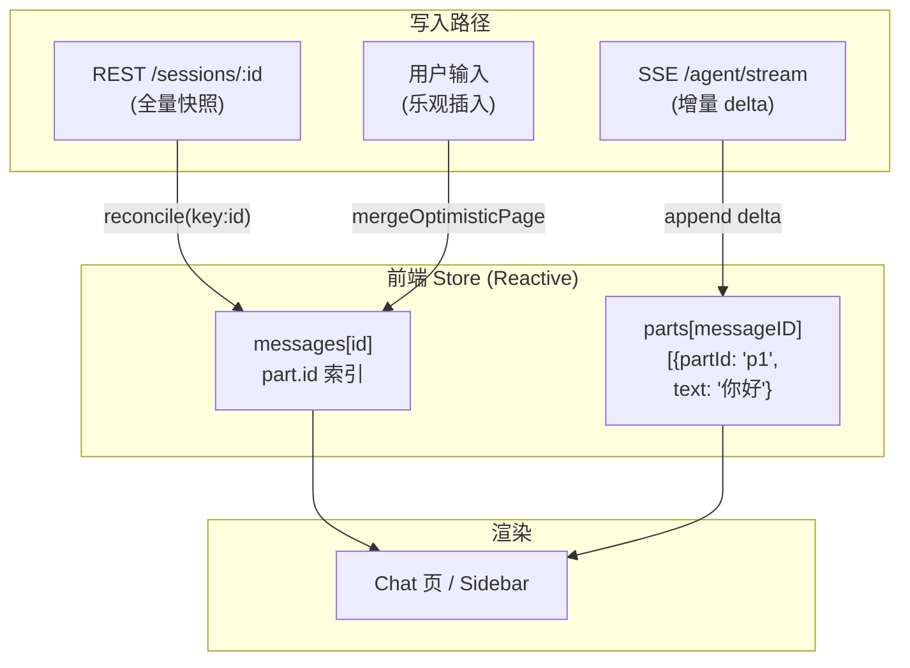

# 一根 SSE 总管，撑起整个 Agent 流式

最近在做一个 Agent 项目，给它接上流式输出。跑通之后心里一直有个疑问：多 Agent 同时跑，前端到底要开几条长连接？直觉告诉我 N 个 Session 就该 N 条 SSE。顺着这个直觉刚要动手，我去钻了 OpenCode 的源码，结果发现它一件事让我重写了整个心智模型——**它只开一条**。

下面是这个调研过程，以及我回到自己项目后做出的取舍。

## 一、3 个 Agent 同时跑，要开几条长连接？

第一反应：N 条。

3 个 Session 各开一条 SSE，session A 推 A 的 delta，session B 推 B 的。每个 Chat 页挂自己那条，断也不影响别的。清晰，隔离，符合直觉。

但这事放到浏览器里就要面对一个事实：**浏览器对同一个 origin 的 HTTP/1 并发上限是 6**。Chrome 现在虽然有 connection pooling、SSE 复用，但每条长连接都会占一格名额；移动端更紧。3 个 Agent 跑起来，再叠 metadata、comments、SSE-warmup 测试这些，很容易撞墙。

更关键的：前端 UI 上你只能同时盯着一个 Chat 页。剩下的 Agent 在后台，它们的 token 在天上飞——你看不见的时候，是不是还在流？

要回答这两个问题，必须去参考实战项目的做法。

## 二、调研：钻进 OpenCode 源码

OpenCode 的前端是 SolidJS，状态管理上很死板，但值得一看。

### 一条 SSE，所有人共用

它有一个 `ServerSDKProvider`，挂在页面 Layout 的最上层——比 Session 页更高。Provider 一挂载就开一条 `GET /global/event` 的 SSE，并且**只在用户离开整个 server 作用域（切换服务器、关闭 tab、pagehide）时关**。

切换 Session、关闭 Chat 页、刷新侧边栏，**这条连接都不动**。所有 Session 共用同一条流。

### 后端不过滤，全量推

`/global/event` 背后是个进程级的 `EventEmitter`，叫 `GlobalBus`。每个事件进来都只打上 `directory` 这个标签，**不过滤**就直接推到所有连上来的客户端。

我之前以为 OpenCode 会在后端按 `sessionID` 过滤——session A 的 delta 只推订阅了 A 的客户端。**完全不是**。每个客户端的 SSE 都收所有 instance、所有 session 的事件，由前端自己 demux。

### 前端分三段消费

事件从 SSE 流到屏幕，分三段：



1. **唯一入口**：`for await` 循环，把流切成 chunk 推进一个 `queue`；
2. **合并 + 批量**：16ms 一帧，同 `(messageID, partID, field)` 的 delta 合并成一个 emit；过 heartbeat 15s 没动静就 abort 重连；
3. **分发给消费者**：上层有一个 reducer listener 按 `directory` 路由到对应 child-store；另一个 `createDirSdkContext` 把 per-directory 事件再细分为 per-event-type，让 UI 各 Provider 各 `event.listen` 自己关心的类型。

整条管线里**只有第一步开网络流**，其它都在内存里派发。

### sidebar 为啥能转？

Chat 页可能关掉，但 sidebar 的 spinner 必须**实时**反映「这个 Session 还在跑」。答案藏在一个 map 里：

```typescript
session_status: { [sessionID: string]: SessionStatus }
// SessionStatus.type === "busy" | "idle" | "retry"
```

reducer 收到 `session.status` 事件就更新这个 map。`session_working(id)` 是个 reactive memo，读这个 map。**无论 Chat 页挂没挂，map 都在被事件流更新**。

侧边栏的项目级 spinner 也是一样：把所有 directory 下的 `session_status[id]` 拉个并集，转一圈找 `busy`。



所以 OpenCode 的根本答案是：

> **一条共享 SSE → 共享 store（按 directory 切多个 child-store）→ UI 各取所需。**

不是 N 条连接，是 **1 条连接 × N 份虚拟 channel**。

## 三、回到自己的项目：流式为啥没流起来

调研完回来盘自己的代码。结构大致是三层：



接到 OpenCode 的启发其实并不大——**结构上已经是一根 SSE 总管了**。Bus 全局单点，endpoint 只发订阅者的事件，session 列表在前端 store 里有。但有几个模糊地带没想清：

**第一，孤儿 delta 怎么处理。** 我这边的 stream 是 runtime 把 chunk 包装成 bus 事件推到 SSE 端。问题是：前端 stream hook 用了 retry-with-backoff 重连，**重连那一刻已经在飞的 chunk 不会被重发**（服务端没 Last-Event-ID）。前端拿到的就是「流到一半断了、再连上」的状态。

**第二，Session 文件持久化 + SSE 流式，会不会写崩。** Runtime 里每个 chunk 都会触发 `FileSessionProvider.save(session)`，把累计 parts 落盘。流式写盘是高频的——前期没出现冲突，但也没认真测过。

**第三，最关键的——前端的 reducer 回调没日志，我连「流到底有没有从服务端进来」都不知道。** 上周调了一晚上，发现请求发了、流式连接建立了，但聊天窗口一片空白。当时没有跨链路日志，定位起来非常难受。

## 四、思考：续接点的真相

回到底层——OpenCode 让我真正想通的，是它对「从哪里继续」这件事的态度。

HTTP 协议里有个惯例叫 `Last-Event-ID`：服务端在每条 SSE 帧里带 `id:` 行，客户端断线重连时把最后收到的 id 放回 header，服务端从那里回放。

我一开始想：自己项目应该实现这个。模型对话断了一半重连，至少能少丢点内容。

**但 OpenCode 也没实现。**

它服务端 `eventData()` 函数写死 `id: undefined`，SSE 帧里从来不带 `id:` 行。客户端 SDK 那段解析逻辑是有的，读了也白读。`Last-Event-ID` 头不会发出去。

这是设计选择，不是漏写。**因为续接点不是事件序号**。

它的接法是：

```
REST GET /session/:id/message → 拿完整状态快照（info + parts + 当前 text）
SSE /global/event             → 只发增量 delta，从"现在起"
两者都写同一个 store，按 part.id 用 reconcile 合并
```

把上面这条线展开就是续接的完整时序：



前端 `message.part.delta` 进来时，reducer 找对应的 part，找不到就丢。**丢的不是内容，是状态机里还不存在的 part**——这部分内容在 REST 快照的 `text` 字段里已经凝固好了。

我之前总想给 SSE 加序号、加版本号、加重连回放，搞出一套「事件对齐算法」。**这是错的方向**。续接点是字符串拼接：`prevText + delta`。幂等靠 part.id，不靠事件序。

## 五、决定：认下三个边界

回到自己项目，定下三条：

**一、一根 Bus 总管，N 个 Session 复用。** 维持现在的单 Bus 结构，不为多 Agent 加连接。Session 列表在前端 store 里按 sessionID 索引，bus 事件按 `(workspace, sessionID)` 路由。多个 Session 同时跑只是 N 份虚拟 channel，连接数 = 1。

**二、REST 快照是真相，SSE 是续接。** 不实现 Last-Event-ID。Session 历史走 REST 端点，stream 走 SSE。Stream hook 重连后从 REST 重拉最新快照，SSE 的 delta 当增量往上 append。

**三、`reconcile({ key: "id" })` 是合并点。** 不引入事件序号。所有写 store 的路径（REST 快照、SSE delta、用户乐观插入）走同一个 reducer，靠 `mergeOptimisticPage` 处理乐观与确认的冲突。

配套做了三件事：

- **去掉动态 import**：之前 provider-loader 里有 `import(expression)` 的动态路径，触发打包工具 `Critical dependency` 警告。改成 session provider 由 container 直接构造实例传入，其它 provider 保留字符串 builtin。警告消失，bundle 也清爽。

- **跨链路日志**：在 runtime 给每个 chunk 加日志，SSE endpoint、remote client、stream hook、session reducer 各加一行 `[前缀]` log。问题是上次的「没流进来」归根到底是日志缺失，定位时间被它吃掉了。

- **看门狗**：前端 15s 没新事件就主动 abort 重连，服务端保留心跳兜底。

把上面所有规则串到一起，就是最终的数据流：



三条写入路径都收敛到同一个 store，靠 `reconcile({key:"id"})` 和 `part.id` 自然合并。Chat 页和 Sidebar 都是这个 store 的纯订阅者，谁也不会因为别人没挂、没渲染而漏写。

## 写到这里

回头看这个调研过程，最值钱的不是「学到了 OpenCode 怎么做」，而是反过来：发现很多直觉（每个 Session 一条 SSE）背后其实是一厢情愿的架构洁癖。在浏览器、网络、服务端 EventBus 三方的挤压下，**N 条连接既不优雅也不实用**。

SSE 像一根自来水总管，REST 是水表读数。你家水龙头关掉的时候，水还在流——水表上也还记录着当前的总量。等你下次打开龙头，水表读数加上流出来的增量，正好等于你打开那一刻的真实用水。这就是续接。

剩下的开放问题是：当这根总管真的撑不住（比如单 message 流到几千个 part，或者客户端在离线状态攒了一批事件要重放），我们要补的是 WebSocket 还是第二条 SSE？这是下一轮要解的事。

但至少现在，**一根总管的水表读数 + 增量 delta，已经能让 N 个 Agent 同时跑、跨页面正常工作了**。

认下这件事比想象的要难。但认下之后，世界反而简单了。
